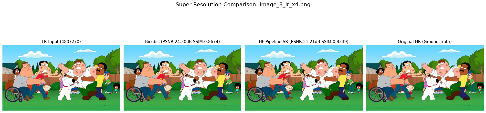
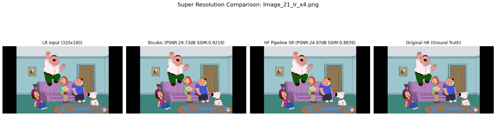

# Deep Learning for Image Super-Resolution (Bicubic vs. SwinIR)

## Introduction and Purpose

The purpose of this project is to compare a traditional interpolation method (Bicubic) with a modern deep learning-based Super-Resolution (SR) model (SwinIR) for enhancing the quality of Low Resolution (LR) images. The performance of these methods was evaluated both using quantitative metrics (PSNR, SSIM) and visual assessment.

## Dataset

* **Source:** The [`Family Guy Scenes`](https://www.kaggle.com/datasets/oulcanakca/family-guy-scenes) dataset from Kaggle was used. This dataset contains various scenes from the Family Guy animated series.
* **LR/HR Pairs:** High Resolution (HR) images selected from the dataset (in different sizes) were downscaled by a factor of **x4** using OpenCV to create corresponding Low Resolution (LR) image pairs. This process allowed us to have reference (ground truth) HR images for comparison. A total of **31** LR/HR pairs were prepared and used.

## Methodology

The following steps were implemented in the project:

1. **Data Preparation:** HR images were selected from the specified dataset and downscaled by a factor of x4 to create LR image pairs (Step B.2 outputs).
2. **Baseline (Bicubic):** The created LR images were upscaled back to their original HR dimensions using OpenCV's `cv2.resize` function with `cv2.INTER_CUBIC` interpolation method (Step B.3 outputs). This serves as the baseline for comparison.
3. **Deep Learning SR (SwinIR - Hugging Face Pipeline):**
   * Initially, simpler models like ESPCN were planned to be used with `cv2.dnn_superres`, but this step was skipped due to difficulties in accessing reliable pre-trained model files.
   * Attempts to load the ESRGAN model directly with PyTorch also failed due to issues with accessing model weights (instability of GitHub/Google Drive links).
   * Consequently, a more reliable approach was adopted using the **Hugging Face `transformers` library's `pipeline` function**.
   * The `caidas/swin2SR-classical-sr-x4-64` model (based on SwinIR architecture, trained for x4 classical SR) available on Hugging Face Hub was used for the `image-to-image` task.
   * The pipeline automatically performed SR processing by taking LR images as input.
4. **Output Size Adjustment:** It was observed that the dimensions of Hugging Face Pipeline outputs could sometimes differ by a few pixels from the original HR dimensions due to the model's internal mechanisms (padding, etc.). Therefore, HF Pipeline SR outputs were **cropped** to exactly match the original HR dimensions before metric calculation.
5. **Evaluation:** Bicubic and (cropped) HF Pipeline SR outputs were compared using the original HR images as reference:
   * **Visual:** LR, Bicubic, HF Pipeline SR, and HR images were plotted side by side to examine visual quality differences.
   * **Quantitative (Metrics):** Peak Signal-to-Noise Ratio (PSNR) and Structural Similarity Index Measure (SSIM) values were calculated using the `scikit-image` library.

## Results

**Quantitative Metrics (Average Values):**

| Method               | Avg. PSNR (dB) | Avg. SSIM |
| :------------------- | :------------: | :-------: |
| Bicubic              |     ~27.71     |  ~0.8964  |
| HF Pipeline (SwinIR) |     ~23.48     |  ~0.8521  |
| *Difference* |    *-4.23* | *-0.0443* |

*(Note: Higher values for PSNR and SSIM indicate better quality.)*

**Visual Assessment and Metric Discrepancy:**

* The metric results (PSNR/SSIM) surprisingly indicate that the simple Bicubic method performs **better** than the SwinIR model.
* However, **visual comparisons** reveal the opposite. Images obtained with the Hugging Face Pipeline (SwinIR) are **noticeably sharper, more detailed, and perceptually much closer to the original HR images** compared to Bicubic results. Bicubic results generally remain blurry.
* This **discrepancy between visual quality and pixel-based metrics** is a known issue in the SR field. Metrics like PSNR/SSIM focus on pixel-level errors or structural similarity; smooth interpolations like Bicubic can score well on these metrics. Advanced models like SwinIR may score lower on these metrics because they **generate new details** that enhance visual quality but might be slightly different from the original at the pixel level. Therefore, looking only at PSNR/SSIM can be misleading, especially when perceptual quality is important, and **visual assessment is critically important.**

*(See the relevant Kaggle Notebook for detailed metrics and visual comparisons.)*

## Discussion and Conclusions

This project has successfully implemented and compared a traditional interpolation method with a modern deep learning SR model. The main conclusions are:

* Deep learning-based SR (SwinIR) **significantly improves visual quality** compared to Bicubic.
* It has been practically observed that there can be **significant differences between standard metrics (PSNR/SSIM) and perceived visual quality** when evaluating SR results. Visual assessment should be prioritized in perceptual quality-focused tasks.
* Using **reliable library centers (like Hugging Face Hub)** for accessing pre-trained models has been experienced to be a much more robust method compared to unstable direct download links.
* Limitations of the project include having tested only one advanced model, quantitative evaluation being limited to PSNR/SSIM, and results potentially being specific to animation-style images.

## Environment and Libraries

* Platform: Kaggle Notebooks (with GPU)
* Main Libraries: `OpenCV (cv2)`, `PyTorch (torch)`, `transformers`, `accelerate`, `huggingface_hub`, `Pillow (PIL)`, `scikit-image`, `numpy`, `matplotlib`.

## How to Run

Open the relevant Kaggle Notebook and run the cells in sequence. The [`Family Guy Scenes`](https://www.kaggle.com/datasets/oulcanakca/family-guy-scenes) dataset should be added to the Kaggle environment. Make sure that file paths in the code (especially `hr_image_dir`) are correctly set.
